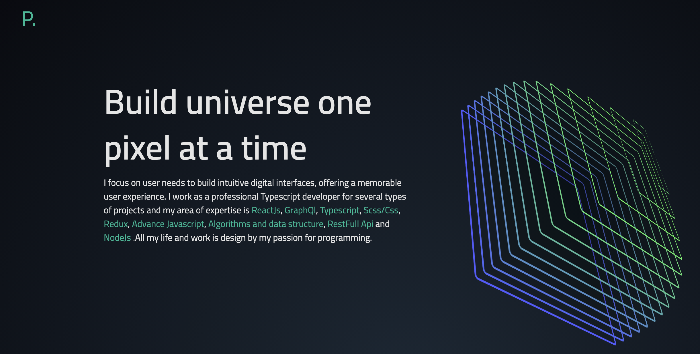

<h1 align="center">
<a href="https://philippetedajo.vercel.app/">Philippe.tedajo</a>
</h1>
<p align="center">
 A beautiful portofolio focus on simplicity, built with <a href="https://nextjs.org/" target="_blank">Next</a>, <a href="https://tailwindcss.com/" target="_blank">TailwindCss</a> and <a href="https://vercel.com/" target="_blank">Vercel</a>
</p>
<p align="center">
    
</p>



## 🛠️ Usage

First, run the development server:

```bash
npm run dev
# or
yarn dev
```

## 🕊️ Building for Production
```bash
npm run build
# or
yarn build
```

